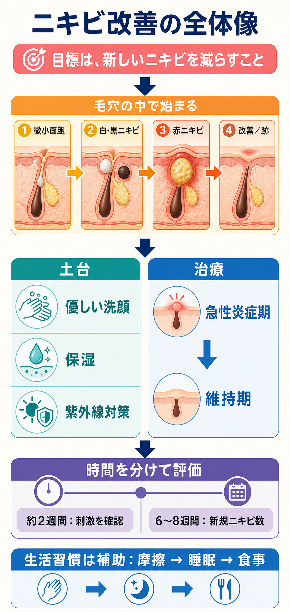

# ニキビ改善を理論から実行へつなぐ

## まず結論

繰り返すニキビは、できた部分だけをその都度処置するのではなく、`毛穴詰まりの形成 -> 炎症 -> 改善 -> 再発` という流れ全体で捉える。基本ケアを土台に標準治療で新しいニキビを減らし、改善後も維持療法を続けることが中心になる。

## これは何か

ニキビができる仕組み、スキンケアと医薬品の役割、治療の評価方法、生活習慣の位置づけを一つの流れで理解するためのノート。個別の診断や薬の選択は、皮膚科医・薬剤師へ相談する。

## どこで使うか

- ニキビが治っては再発する理由を理解したいとき
- 化粧品、医薬部外品、医薬品の役割を区別したいとき
- 治療を何日・何週間で評価すべきか迷ったとき
- 食事や睡眠をどの程度重視すべきか判断したいとき

## 全体像

### 1. ニキビは毛穴の中から始まる

```text
目に見えない微小面皰
        ↓
白ニキビ・黒ニキビ
        ↓
赤ニキビ・膿疱
        ↓
改善／赤み・色素沈着・瘢痕
```

主に `皮脂分泌` `毛穴の角化異常` `アクネ菌` `炎症` が関係する。表面の汚れだけが原因ではないため、強い洗顔や摩擦では解決しない。

### 2. 「治ったのにまたできる」の正体

見えているニキビが治っても、別の毛穴では微小面皰が進行していることがある。治療目標は、現在の炎症を治すことに加えて、次の面皰を作らせにくくすることになる。

### 3. スキンケアと治療を分担する

| 手段 | 主な役割 |
|---|---|
| 化粧品 | 優しい洗浄、保湿、紫外線対策で治療の土台を作る |
| 医薬部外品 | 承認された範囲でニキビ予防を補助する |
| 医薬品 | 毛穴詰まりや炎症を治療し、再発を抑える |

基本ケアは `優しい洗顔 -> 保湿 -> 日中の紫外線対策`。ノンコメドジェニック表示は製品選びの目安になるが、すべての人にニキビができない保証ではない。

### 4. 治療は急性炎症期と維持期に分ける

| 治療 | 毛穴詰まり | 炎症 | 維持療法での位置づけ |
|---|---:|---:|---|
| アダパレン | 主に対応 | 間接的に対応 | 中心 |
| 過酸化ベンゾイル | 対応 | 対応 | 中心 |
| アダパレン＋過酸化ベンゾイル | 強く対応 | 対応 | 中心 |
| 外用・内服抗菌薬 | 主目的ではない | 主に対応 | 原則として長期使用しない |

抗菌薬で炎症を抑えた後は、アダパレンや過酸化ベンゾイルなどによる維持療法へ移るのが標準的な考え方。妊娠中・妊娠予定では使えない薬があり、刺激や接触皮膚炎も起こり得るため、具体的な選択と使い方は医療者の指示に従う。

### 5. 効果は時間軸を分けて判定する

- 開始から約2週間: 乾燥、赤み、皮むけ、かゆみなど、継続できる刺激かを見る
- 6〜8週間: 1週間にできる新しい赤ニキビ数が減ったかを見る
- 改善後: 再発せず安定しているか、維持療法を確認する

同じ照明・角度の写真と、週ごとの新規ニキビ数を記録する。一度に複数の製品を変更すると、効果と刺激の原因を切り分けにくくなる。

### 6. 生活習慣は補助要因として扱う

優先順位は `標準治療 -> 基本ケア -> 摩擦や蒸れ -> 睡眠リズム -> 個別の食事検証`。

万人共通の禁止食品は明確ではない。高GI食や牛乳との関連を示唆する研究はあるが、結果は一貫していないため、極端な制限ではなく、疑わしいものを一つずつ記録して検証する。

## 理解用イラスト

この図は、ニキビが形成される流れと、基本ケア・治療・評価・生活習慣の優先順位を一枚で戻すためのもの。



## よくある疑問

### Q. ニキビは顔が不潔だからできる？

A. 不潔だけが原因ではない。洗いすぎや摩擦は炎症を悪化させることがあるため、1日2回程度を目安に優しく洗う。

### Q. 赤ニキビが治れば治療終了？

A. 別の毛穴で微小面皰が進んでいる場合がある。炎症が落ち着いた後も、再発予防の維持療法を検討する。

### Q. 化粧品だけで治せる？

A. 化粧品は治療を支える土台。繰り返すニキビや炎症性ニキビでは、標準的な医薬品治療を皮膚科で相談する価値が高い。

### Q. 食べ物を変えれば治る？

A. 食事だけで治療を置き換えることは難しい。バランスのよい食事を基本に、本人に再現性がありそうな食品だけを一つずつ検証する。

### Q. いつ皮膚科へ行く？

A. 再発が続く、痛いしこりや膿がある、へこみ・盛り上がりが残り始めた、強い刺激がある、6〜8週間適切に治療しても改善しない場合は受診する。軽症でも早期から相談できる。

## 実務での見方

### 最小実行プラン

1. 同じ条件で顔の写真を撮り、赤ニキビ・面皰・痛いしこりを分けて記録する。
2. 洗顔、保湿、日焼け止めを低刺激でシンプルな構成に固定する。
3. 皮膚科で、面皰治療と維持療法が必要か相談する。
4. 最初の2週間は刺激、6〜8週間は新規ニキビ数で評価する。
5. 明確な改善があれば継続し、効果不足・強い刺激・瘢痕があれば早めに再評価する。
6. 生活習慣は摩擦、睡眠、疑わしい食品の順で一つずつ検証する。

### 判定表

| 状態 | 次の判断 |
|---|---|
| 新規ニキビが減り、刺激が軽い | 指示どおり継続 |
| 改善しているが乾燥がつらい | 保湿や使用方法を医療者と調整 |
| 6〜8週間使っても変化が乏しい | 診断、薬、使用量、塗布範囲を再確認 |
| 痛いしこり、瘢痕、急速な悪化 | 評価期間を待たず皮膚科へ相談 |
| 強いかゆみ、腫れ、水ぶくれ | 使用を止めて医療機関へ相談 |

## 次回の確認

- [ ] ニキビの場所と種類を分けて記録できているか
- [ ] 現在の製品と薬の役割を説明できるか
- [ ] 新規ニキビ数と刺激を別々に評価できているか
- [ ] 改善後の維持療法を確認したか

## 関連トピック

- 関連トピックは未設定

## 参考リンク

- [日本皮膚科学会「にきびQ&A」](https://qa.dermatol.or.jp/qa3/)
  - ニキビの仕組み、治療、洗顔、食事、睡眠などの患者向け公式情報を確認する。
- [日本皮膚科学会「尋常性痤瘡・酒皶治療ガイドライン2023」](https://www.dermatol.or.jp/uploads/uploads/files/guideline/zasou2023.pdf)
  - 急性炎症期と維持期の標準治療、各治療の推奨度を確認する。
- [American Academy of Dermatology「Acne: Diagnosis and treatment」](https://www.aad.org/public/diseases/acne/derm-treat/treat)
  - 治療効果が現れるまでの目安と、皮膚科治療の全体像を確認する。
- [American Academy of Dermatology「Can the right diet get rid of acne?」](https://www.aad.org/public/diseases/acne/causes/diet)
  - 高GI食や牛乳とニキビの研究状況、食事だけでは治療を置き換えられない点を確認する。

## 更新履歴

- 2026-08-16: 初版作成。
