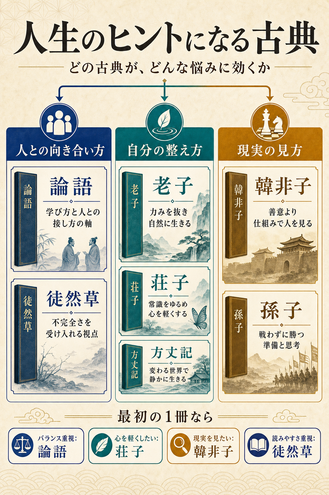

# まず結論

人生のヒント目的で古典を読むなら、`人との向き合い方` `自分の整え方` `現実の見方` の3軸で選ぶと入りやすいです。  
最初の1冊は、軸を整えたいなら `論語`、力みを抜きたいなら `荘子`、現実を冷静に見たいなら `韓非子` が向いています。

## これは何か

古典を `昔の難しい本` としてではなく、今の生き方に引きつけて選ぶための入口メモです。  
どの古典が何を教えてくれる本なのかを、あらすじと読み味の違いで短く戻せるようにしています。

## どこで使うか

- 人生観を広げたいとき。
- 人間関係や組織の見方を深めたいとき。
- その時の悩みに合う古典を1冊選びたいとき。

## 全体像

- `論語`
  - 孔子と弟子たちの対話集。学び方、人との接し方、自分の整え方を短い言葉で積み上げる。
- `老子`
  - 無理に押し通さず、自然な流れを活かす発想を語る本。頑張りすぎを緩める方向に効く。
- `荘子`
  - 常識や成功の物差しを揺さぶる寓話集。世間の評価に縛られすぎた頭をほぐしやすい。
- `韓非子`
  - 人は善意だけでは動かない前提で、権力、制度、ルールの使い方を語る現実主義の本。
- `孫子`
  - 戦いの本だが、本質は `無駄に戦わず、勝てる条件を整える` こと。準備と見極めの本として読める。
- `徒然草`
  - 人生、世の中、無常を軽やかに綴った随筆。不完全さを受け入れる視点が得やすい。
- `方丈記`
  - 災害や社会不安の中で、変わる世界をどう受け止めるかを考える短い随筆。

## 理解用イラスト

この図は、古典を `人との向き合い方` `自分の整え方` `現実の見方` の3軸で見比べるためのものです。  
同じ古典でも効く悩みが違うので、タイトルより `どんな時に読むと刺さるか` で選ぶと入りやすくなります。

## よくある疑問

### Q. 最初の1冊は何がよい？

A. 迷ったら `論語` が最も無難です。人としての軸、学び方、人との接し方に広く効くからです。今の社会を現実的に見るヒントが欲しいなら `韓非子`、少し心を軽くしたいなら `荘子` が向いています。

### Q. `韓非子` は冷たすぎない？

A. かなり冷徹です。ただし `人は理想通りには動かない` と認めた上で、制度やルールをどう設計するかを見る本としては非常に鋭いです。人生訓というより、人間観察や組織理解に強い古典です。

### Q. 読みやすさ重視ならどれ？

A. 日本語で入りやすいのは `徒然草` と `方丈記` です。中国古典なら `論語` は短章が多く、少しずつ読めます。`荘子` は寓話が多いので、発想としては入りやすい部類です。

### Q. 悩み別にどう選べばよい？

A. `人間関係や学び方` なら `論語`、`頑張りすぎや執着` なら `老子` `荘子`、`組織や権力の現実` なら `韓非子`、`仕事や交渉に応用したい` なら `孫子` という分け方が使いやすいです。

## 実務での見方

- `論語` は、姿勢や信頼の作り方を見る本として仕事にもつながる。
- `韓非子` は、善意任せではなく仕組みで回す発想として組織を見るときに効く。
- `孫子` は、勝負の場面より `準備、情報、条件設計` の本として読むと応用しやすい。
- `老子` `荘子` は、成果や評価に飲まれすぎない心の置き方として役立つ。

## 次回の確認

- [ ] 自分が今読むなら `論語 / 荘子 / 韓非子` のどれが一番合うかを1つ決める。
- [ ] `人との向き合い方 / 自分の整え方 / 現実の見方` の3軸を見ずに言い直せるか確認する。
- [ ] 次に広げるなら `中国古典` と `日本古典` のどちらから入るか決める。

## 関連トピック

- [雑学の分野まとめ](../10_分野まとめ.md)

## 参考リンク

- 一般公開された参考リンクは未追加
  - 今回は会話で整理した比較軸を先に保存し、必要になった時だけ補足する。

## 更新履歴

- 2026-07-05: 新規作成。
