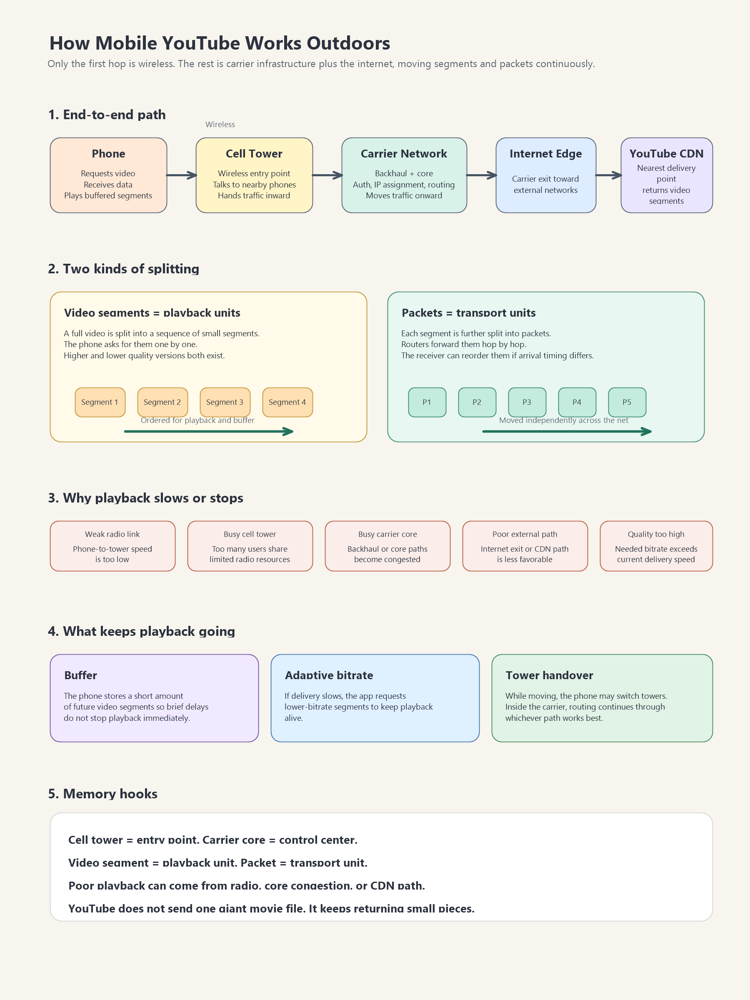

# まず結論

外で携帯から YouTube を見られるのは、スマホが近くの基地局まで無線でつながり、その先では携帯会社の大規模ネットワークとインターネットが、動画を細かい単位に分けて運び続けているからです。  
理解の芯は、`基地局は入口` `コアネットワークは中枢` `動画は断片とパケットに分かれて届く` の 3 点です。

## これは何か

「ネットワークはなぜつながるのか」を、外でスマホから YouTube を見る場面で具体化したトピックです。  
特に、基地局から先で何が起きているかと、動画ストリーミングがどう成立するかをまとめています。

## どこで使うか

- 携帯通信と Wi-Fi の違いを理解したいとき
- 4G / 5G の説明を、仕組みベースで整理したいとき
- 動画が止まる原因を、電波以外も含めて考えたいとき
- ネットワークの基本を、IP や DNS より一段手前の直感でつかみたいとき

## 全体像

- スマホは YouTube に直接つながるのではなく、`スマホ → 基地局 → 携帯会社の内部網 → インターネット出口 → YouTube 配信網` の順で通信する
- 無線なのは主に `スマホ ↔ 基地局` の区間で、その先は光回線などの有線中心の大規模ネットワークで運ばれる
- 動画は丸ごと 1 本で届くのではなく、`数秒単位の動画断片` に分かれて配信される
- その動画断片も、ネットワーク上ではさらに `パケット` に細かく分かれて運ばれる
- スマホは届いた断片を少し先までためる `バッファ` を持ち、順番に再生する

## よくある疑問

### Q. 外で見ている動画は、空中をずっと電波で飛んでいるのか

A. いいえ。電波なのは主にスマホと基地局の間だけです。その先は携帯会社の内部ネットワークとインターネットが運びます。

### Q. 基地局は何をしているのか

A. 基地局はスマホの電波を受け取り、携帯会社のネットワークへ引き渡す入口です。認証や通信制御の中心は、その先のコアネットワークが担います。

### Q. パケットと動画断片は同じものか

A. 同じではありません。動画断片は `再生しやすい単位`、パケットは `運びやすい単位` です。動画断片がさらに複数のパケットに分かれて届きます。

### Q. 電波が立っているのに動画が遅いのはなぜか

A. 混雑原因は基地局の電波だけとは限りません。基地局から先の回線、携帯会社の内部網、インターネット出口、YouTube 側の配信経路でも遅くなります。

## 実務での見方

- 通信品質は `無線区間` と `基地局から先` を分けて考える
- 動画再生は `リアルタイムの一本線` ではなく、`断片を先読みしながら再生する配送システム` と見る
- 遅延や停止の原因は `電波` `混雑` `配信経路` `画質設定` に分けて切り分ける
- 4G / 5G の説明では、速度の話だけでなく `同時接続` `遅延` `接続維持` も見る

## 理解用イラスト

この図は、スマホから基地局、携帯会社の内部網、インターネット出口、YouTube 配信網までの流れと、`動画断片` `パケット` `バッファ` の関係を 1 枚で見返すためのものです。

## 次回の確認

- [ ] `基地局は入口、コアネットワークは中枢` と言えるか
- [ ] `動画断片` と `パケット` の違いを説明できるか
- [ ] 動画が止まる原因を、電波以外も含めて 3 つ以上挙げられるか

## 関連トピック

- [AMとPMの基本](./AMとPMの基本.md)

## 参考リンク

- 一般公開された参考リンクは未設定

## 更新履歴

- 2026-06-06: 初版作成
