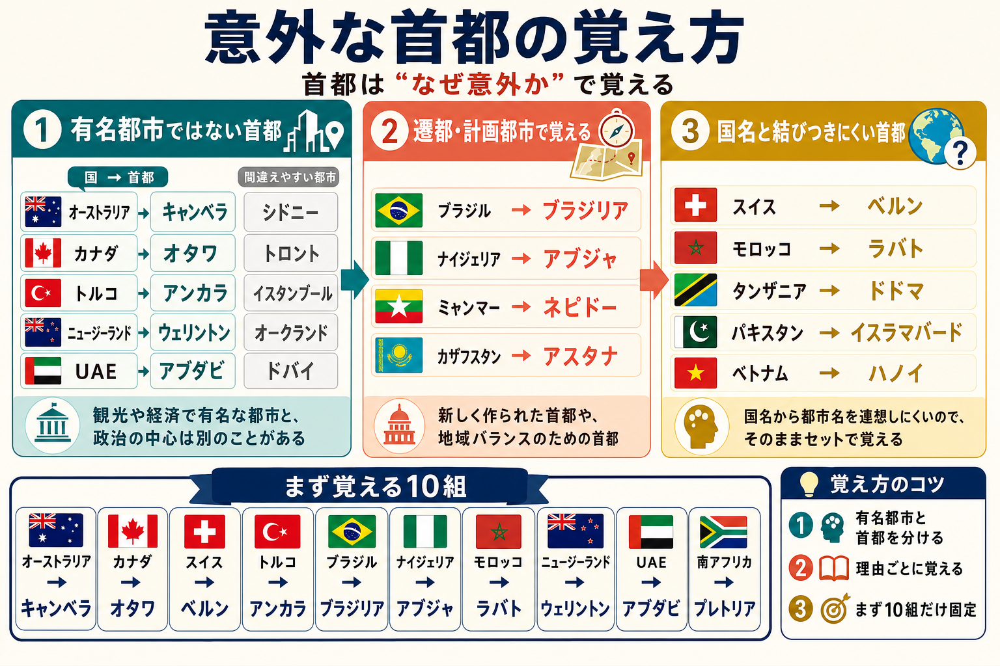

# まず結論

首都は全部を同じ重さで覚えるより、`有名都市ではない首都` `国名と都市名が結びつきにくい首都` `遷都でできた首都` の3型で覚えると定着しやすいです。  
特に外しやすいのは、観光や経済で有名な都市が別にある国です。

## これは何か

国の首都を、`意外に感じやすい理由` で整理して覚えるためのメモです。  
単なる一覧ではなく、どこで間違えやすいかを先に見える形にしています。

## どこで使うか

- 世界地理の基本を短時間で復習したいとき
- クイズや一般常識で首都を問われたとき
- 旅行、ニュース、国際話題で都市名を取り違えたくないとき

## 全体像

- まず `有名都市と首都がズレる国` を先に固める
- 次に `新しく計画された首都や遷都した国` をまとめて覚える
- 最後に `国名と首都名が結びつきにくい国` を地域ごとに増やす

特に覚えやすい意外な首都:

- オーストラリア: キャンベラ
- カナダ: オタワ
- スイス: ベルン
- トルコ: アンカラ
- ブラジル: ブラジリア
- ナイジェリア: アブジャ
- モロッコ: ラバト
- ニュージーランド: ウェリントン
- UAE: アブダビ
- 南アフリカ: プレトリア

## 理解用イラスト

この図は、`なぜ意外に感じるのか` を3つの型で見分けるためのものです。  
首都名だけでなく、よく混同される有名都市も一緒に見ると記憶が戻りやすくなります。

## よくある疑問

### Q. どの国から先に覚えると効率がよい？

A. `有名都市ではない首都` から先に覚えるのが効率的です。シドニー、トロント、イスタンブール、ドバイのような有名都市に引っ張られやすい国から固めると、間違いが大きく減ります。

### Q. なぜ首都が最大都市ではない国があるのか？

A. 政治の中立性、地域バランス、遷都、計画都市の建設などが理由です。ブラジルのブラジリアやナイジェリアのアブジャは、その典型です。

### Q. 南アフリカの首都はケープタウンではないのか？

A. 行政首都はプレトリアです。南アフリカは機能が分かれていて、ケープタウンは立法、ブルームフォンテーンは司法の中心として覚えると混同しにくくなります。

### Q. 一覧をそのまま丸暗記した方が早くないか？

A. 最初の一周は一覧でもよいですが、忘れにくさは `なぜ意外か` を理解した方が上です。理由つきで覚えると、次に思い出すときの手がかりが増えます。

## 実務での見方

- ニュースや国際話題では `有名都市` と `政治の中心` を分けて見る
- 国のイメージ都市がそのまま首都とは限らない前提を持つ
- 覚える順番は `北米とオセアニア` `ヨーロッパ` `中東とアフリカ` のように小分けにする
- まず20か国前後を固定し、その後で地域別に増やす

## 次回の確認

- [ ] オーストラリア、カナダ、スイス、トルコ、UAE の首都を即答できるか
- [ ] `有名都市ではない首都` を5組以上言えるか
- [ ] `遷都や計画都市だから覚えやすい首都` を2つ以上挙げられるか

## 関連トピック

- [雑学の分野まとめ](../10_分野まとめ.md)

## 参考リンク

- 一般公開された参考リンクは未設定

## 更新履歴

- 2026-06-27: 初版作成
